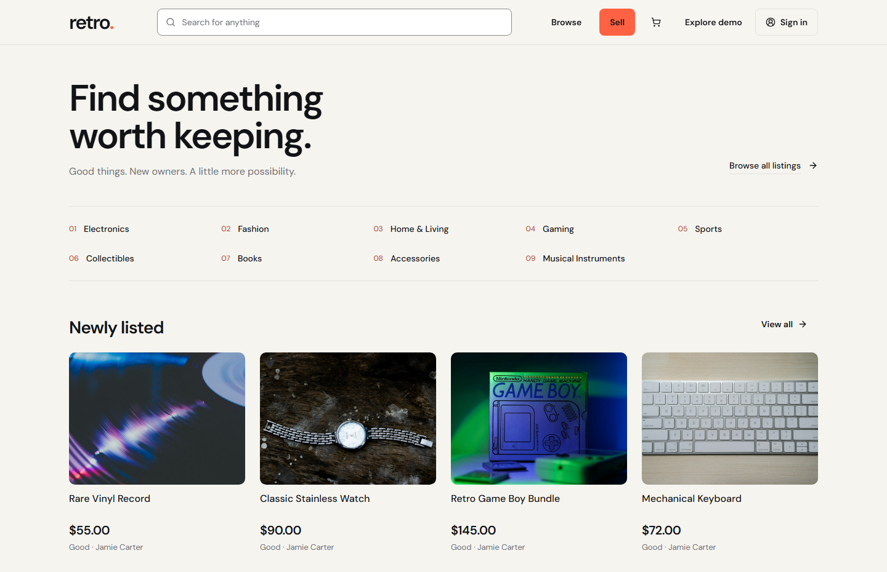
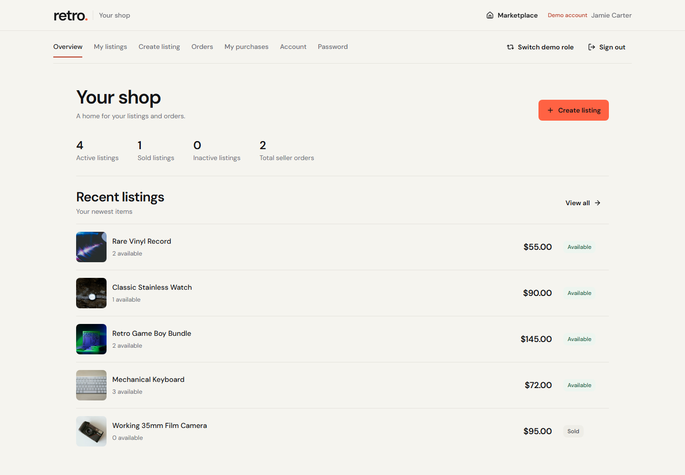
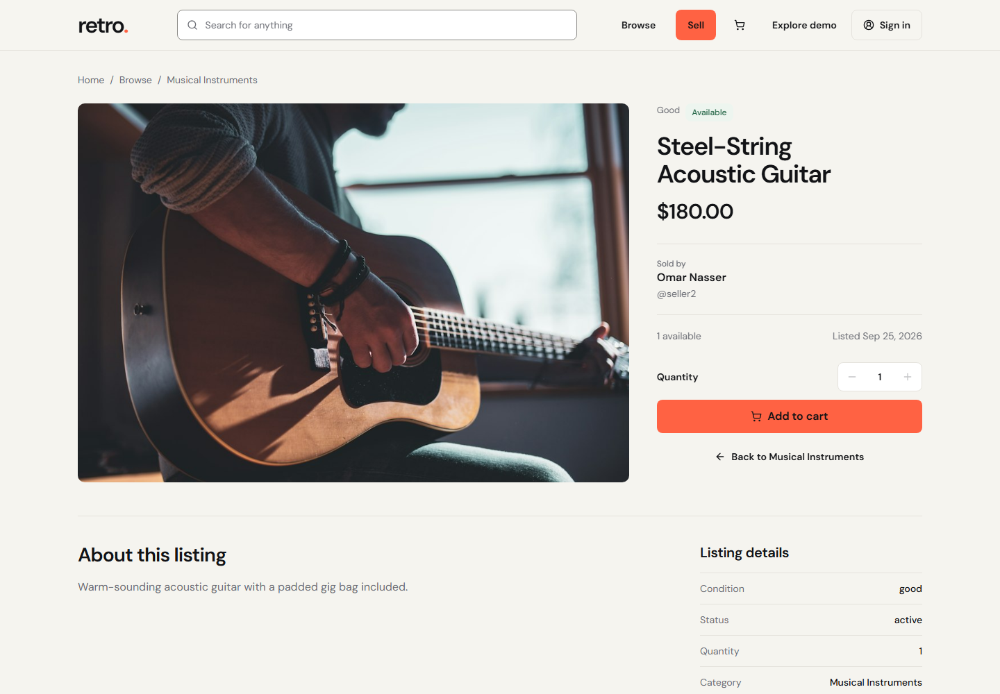
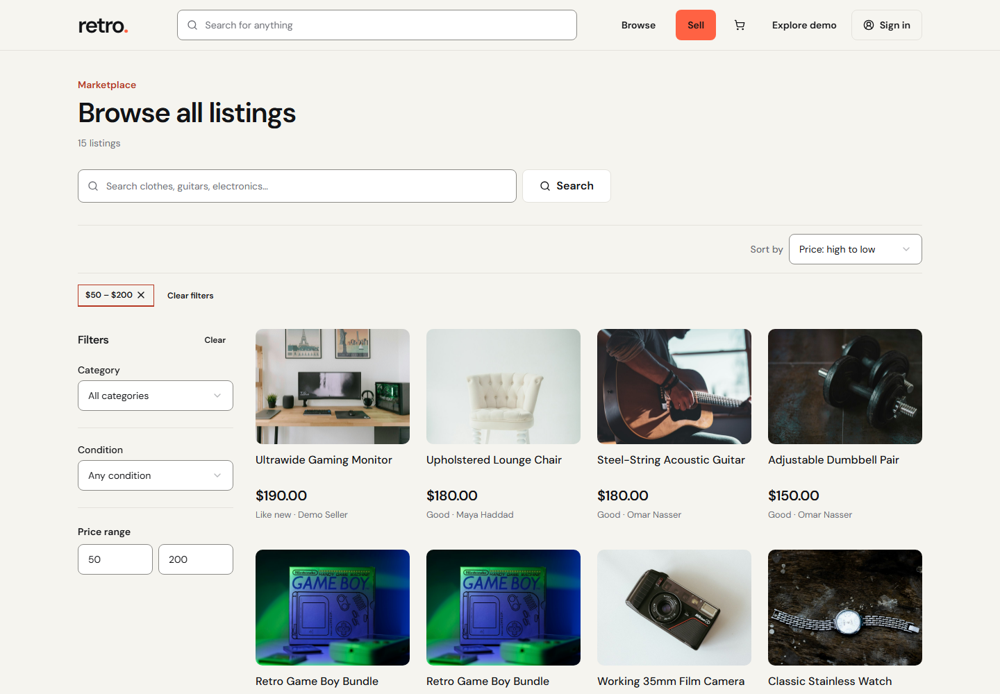
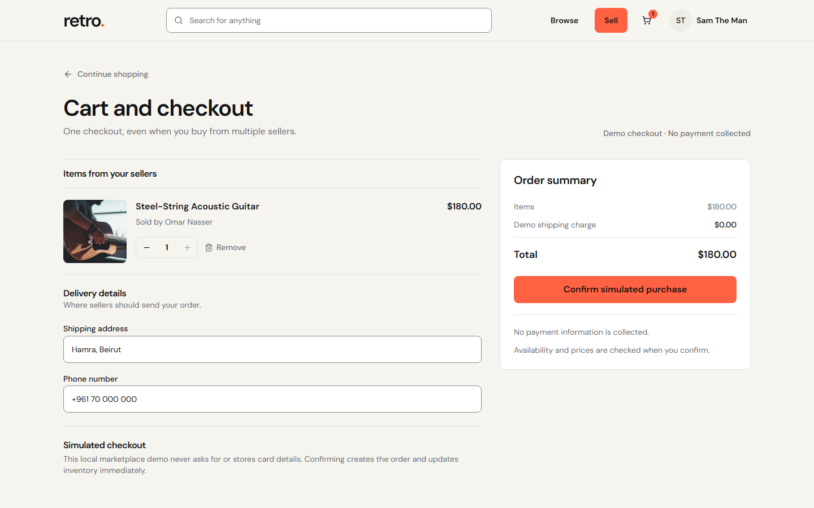
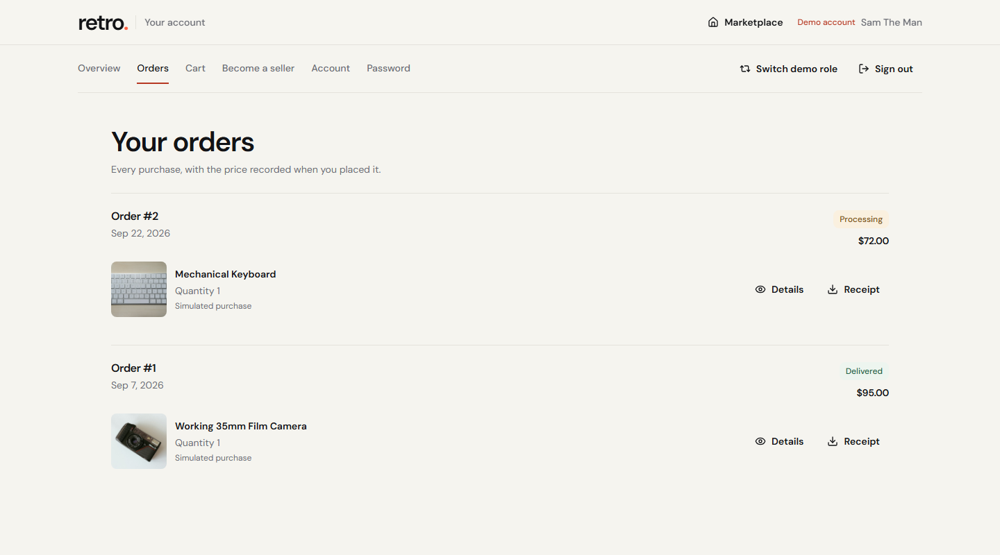

# Retro

A marketplace for giving useful things a second home. Browse listings, keep a cart, check out, and follow orders as a buyer. Sellers can publish listings, manage stock, and fulfill orders.

[Open the live demo](https://retro-production-d07b.up.railway.app) · [Run it locally](#run-locally)

The demo has ready-made buyer and seller accounts. Checkout records an order without charging a card.

## A look around

| Marketplace | Seller dashboard |
| --- | --- |
|  |  |
| **Listing detail** | **Search and filters** |
|  |  |
| **Checkout** | **Order history** |
|  |  |

## Try it

Open the live demo and choose **Explore demo**, then **Explore as Buyer** or **Explore as Seller**. You can browse without signing in. To see an order go through the whole flow:

1. As Buyer, add a listing to the cart and complete checkout.
2. Open purchase history to see the order.
3. Switch to Seller to find the incoming order and update its status.

Demo accounts, listings, and orders are fictional. The public demo uses an in-memory database, so visitor changes are shared until the service restarts.

## How it works

The frontend is React 19, TypeScript, Vite, Redux Toolkit, and Tailwind CSS. The API is Java 17, Spring Boot, Spring Security, and JPA. One Docker image serves the built frontend and API on Railway. Local and demo runs use H2; the repository also includes a MySQL driver for a separately configured deployment.

A few decisions matter more than the framework list:

- **Stock at checkout:** the API reloads prices and stock, locks listing rows in a transaction, and commits the order and inventory change together. A concurrent checkout test checks that the last item can only be sold once.
- **Orders that stay readable:** order items keep the listing title, image, seller, and price from purchase time. Later listing edits do not change old receipts.
- **Seller boundaries:** the authenticated seller can edit their listings and see only their part of an order that contains items from multiple sellers.
- **Session handling:** authentication uses `HttpOnly` cookies, CSRF protection, and a token version that invalidates old JWTs after logout or account changes.
- **Images:** uploads are checked for type and size, given new filenames, and stored inside the configured upload directory.

Checkout is simulated. There is no payment processor or shipping integration.

## Run locally

You need Java 17+, Node.js 20.19+ or 22.12+, and npm. Start the backend and frontend in separate terminals from the repository root.

**Backend, macOS/Linux**

```sh
cd backend
./mvnw spring-boot:run -Dspring-boot.run.profiles=local,demo
```

**Backend, Windows PowerShell**

```powershell
cd backend
.\mvnw.cmd spring-boot:run "-Dspring-boot.run.profiles=local,demo"
```

**Frontend**

```sh
cd frontend
npm ci
npm run dev:demo
```

Visit [localhost:5173](http://localhost:5173). The local demo resets its H2 database when the backend restarts. You can also sign in directly with `buyer@retro.demo` or `seller@retro.demo`; both use `retro123`. These credentials are for the demo only.

## Checks

```sh
cd frontend
npm run lint
npm test
npm run build
```

```sh
cd backend
./mvnw test
```

Use `.\mvnw.cmd` on Windows. The Playwright scripts in `scripts/` cover demo entry, checkout and inventory races, and keyboard accessibility while both local services are running. The broader regression changes demo data, so run it against a disposable local database.

## Current limits

- The public database and local uploads are ephemeral. A durable deployment needs persistent storage and a reviewed database migration.
- The cart lives in the browser and does not sync across devices.
- Password-reset email needs an SMTP service, which the public demo does not have.
- Legal and support copy needs review before use in a real marketplace.

## Credits

Retro began with educational marketplace code from [Local-Market](https://github.com/aymanbest/Local-Market) and [Finn-Frontend-Reactjs-Marketplaces](https://github.com/shariyerShazan/Finn-Frontend-Reactjs-Marketplaces). The buyer and seller flows, demo, and deployment were reworked for this project. Demo photo sources are listed in [SOURCES.md](frontend/public/demo/SOURCES.md). Check the upstream licenses before redistributing the code.
